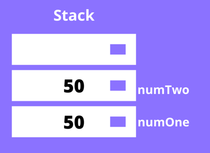
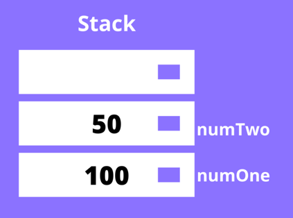

## 서론
데이터 타입(data type) 이란 개발을 할때 매일매일 사용하고 무조건적으로 이해해야 하는 개념이라 생각한다.

javascript 에서는 데이터 타입을두개로 나눈다. 하나는 원시(primitive)타입이고, 다른 하나는 참조(reference)타입 이다. 본고에서는 이 둘의 차이점에 대해 다룰 예정이다.

## 본론

### 자바스크립트의 원시(primitive) 타입.

자바스크립트의 원시타입으로는 number, bigint, string,boolean ,null, undefined 와 symbol 총 7개가 존재한다. 이들의 공통점은 object가 아니며, 따로 메서드(method)를 가지지 않는다.


하지만 여기서,

> 자바스크립트의 "string 타입" 은 메서드를  가지는데? 그러면 원시타입이 될수 없지 않은가?

라는 생각이 들수있다

이는 자바스크립트의 런타임이 아래와 같은 코드를

```js
"tmp".concat();
```
`string` 오브젝트로 생성하기에 메서드를 가질수 있다.
```js
const str = new String('tmp');
```

## 원시타입은 어떻게 작동하는가?

자바스크립트에서 원시타입을 `선언(declare)`하면, 이는 `스택(stack)`에 저장된다.스택이란 `LIFO(Last IN First Out)` 구조를 가진 `자료구조(data structure)`이다. 저장된 원시타입은 `식별자`를 통해 접근할 수 있고, 원시 데이터와 함께 스택에 저장된다.

```js
const numOne = 50;
const numTwo = 50;
```
위와 같이 같은 값을 가진 두개의 변수가 선언 및 할당되었을 때, numOne이 값과 함께 스택에 푸쉬되고, 그 위에 numTwo가 값과 함께 스택에 푸쉬된다. 같은 값이 있건 말건 전혀 상관없는 두개의 공간이 생성된다.




이때 `numOne`의 값을 변경한다해도 `numTwo`에는 전혀 지장이 없다.

```js
let numOne = 50;
let numTwo = numOne;
numOne = 100;
console.log(numOne); // 100
console.log(numTwo); // 50
```




