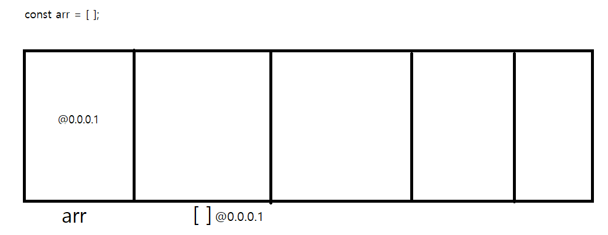
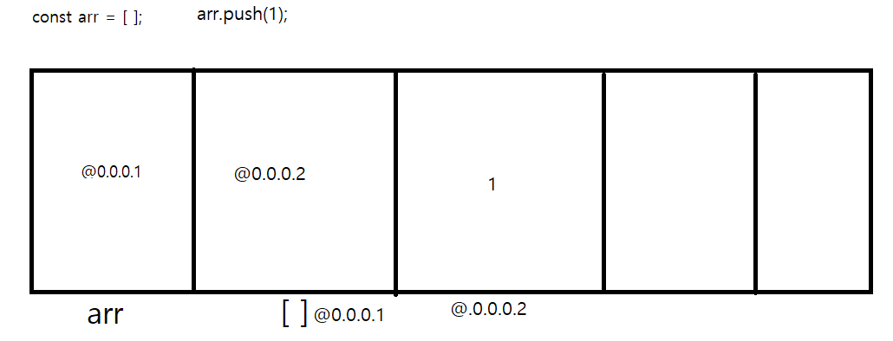

# 목차
- 데이터 저장은 어디에서?
- 원시 타입과의 차이
- 참조 타입의 저장 방식
- const

## 데이터 저장은 어디에서?
원시 타입과 참조 타입 흔히 데이터 타입이라고 불리는 이 두 분류의 데이터 들은 메모리에 저장 됩니다. 메모리의 저장방식은 빠르지만 휘발성이죠

## 원시 타입과의 차이
같은 데이터 타입 이지만 서로 알면 알수록 정말 다릅니다.
원시 타입은 간단하게 설명드리면 변수가 선언되는 순간 메모리의 자신 저장 자리를 찾아내고 그 자리에 자신의 값을 저장 합니다.
원시 타입은 이런 저장방식으로 인해 하나의 데이터 밖에 저장할 수 없습니다.

그에 반해 참조 타입은 다릅니다. 객체, 배열, 함수 모두 하나의 변수 안에 수많은 데이터들이 존재할 수 있습니다.
그게 가능한 이유는 원시타입과 저장 방식이 다르기 때문입니다.
## 참조 타입의 저장방식
참조 타입의 저장 방식은 독특합니다. 원시 타입처럼 원시적이지 않고 말 그대로 `참조`타입처럼 참조를 하는 형식입니다.
변수가 선언되면 변수가 자신의 데이터 저장할 곳을 찾는 행위까지는 동일합니다.
하지만 그 이후부터 큰 차이를 보이는데, 바로 자신의 값이 저장되어야 할 메모리에 자신이 참조 할 일종의 링크를 저장하게 됩니다.
그리고 그 링크는 다른 데이터가 존재하는 링크가 되고 이런식으로 자신의 데이터 저장 공간을 늘려가면서 서로 참조하게 됩니다.

그림으로 설명해 드리도록 하겠습니다



우선 변수를 지정한 뒤 배열을 만듭니다.
변수가 선언 됐으니 데이터를 저장할 메모리 공간을 확보 할텐데 바로 그 공간에 배열의 링크가 저장되는 형식입니다.

자신이 찾는 데이터를 다른 메모리 공간에서 참조 하기 때문에 참조 타입이라고 불리기도 합니다. 덕분에 외우기 쉬웠습니다.

그럼 여기 배열에서 값이 추가 된다면 어떻게 될까요?



바로 다음 메모리 공간에 저장이 되게 되고 배열이 저장된 자리엔 배열의 값을 참조할 데이터의 링크가 남게 됩니다.

이게 바로 참조타입의 저장방식 입니다.

## const

우리가 처음에 배운 const 는 분명 재선언 및 재할당이 불가능한데 어째서 배열의 값이 달라질 수 있었을까요?

왜냐하면 변수 자체의 값은 달라지지 않았기 때문입니다. 변수의 값은 여전히 배열의 링크로 변함이 없으며 순수하게 배열의 값만 추가 되었기 때문에 가능한 일입니다.

그렇기 때문에 배열의 값이 서로 같은 변수끼리도 비교 연산자를 통해 true 인지 false 인지 판단하게 되면 false를 반환하게 되는 것입니다.

```js
const a = [1,2,3,4,5]
const b = [1,2,3,4,5]

console.log(a===b) // false
```
왜냐하면 서로 배열의 값이 같을 지언정 변수끼리 서로 메모리에 저장한 위치가 다르기 때문에 당연히 변수에 저장된 링크가 다르기 때문입니다.