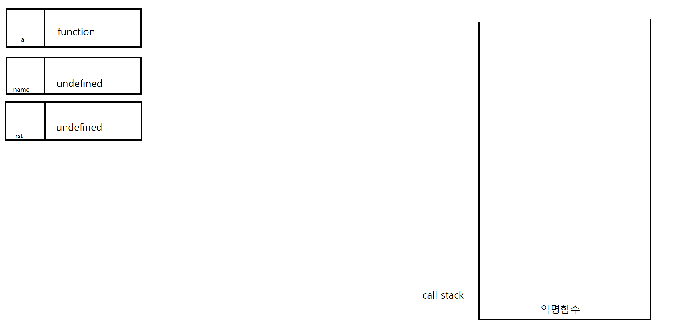
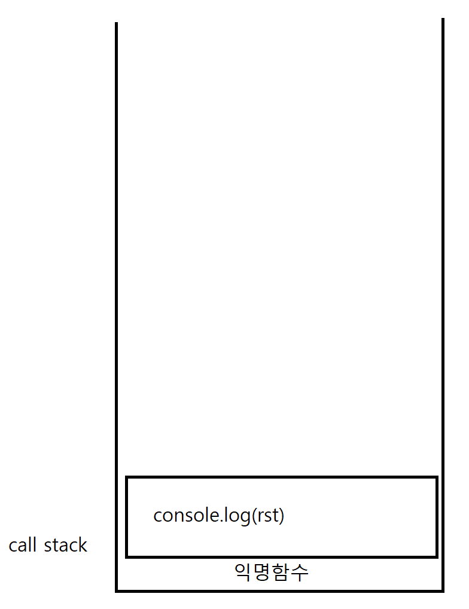
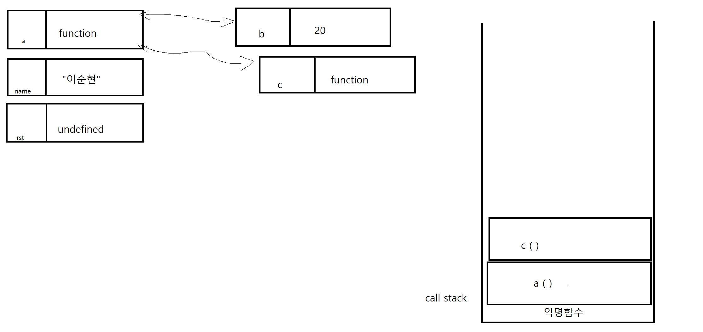
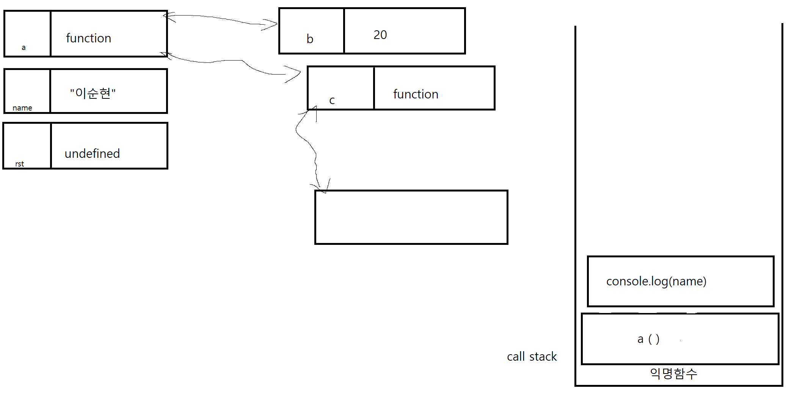
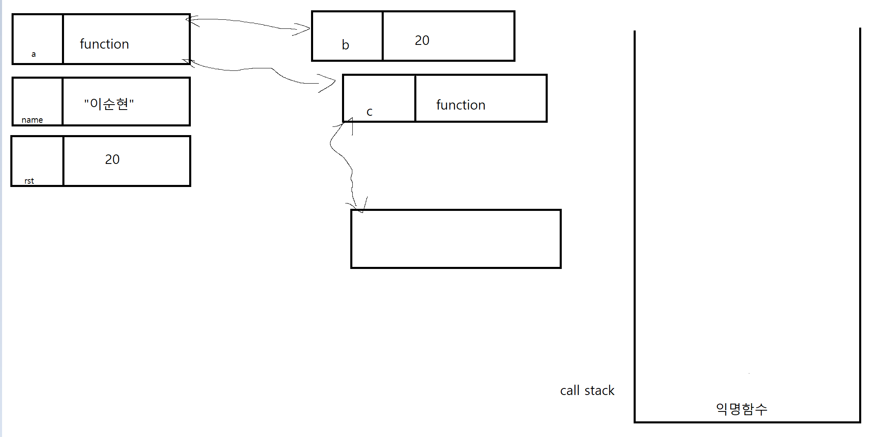

# 목차
- 실행 컨텍스트란 ?
- 실행 컨텍스트 설명 함수

## 실행 컨텍스트란 ?
함수를 이해하기 위해 우선 실행 컨텍스트의 개념을 완벽하게 알아두고 가야 합니다. 그러기 위해선 실행 컨텍스트가 무엇인지 알아야겠죠.

자바스크립트 실행 컨텍스트를 웹 서핑으로 직접 찾아봤을 때 모든 블로그들이 하나같이 입을 모아 `실행할 코드의 제공할 환경 정보들을 모아 놓는 객체 입니다.` 라고 설명 해주시는데 사실 저렇게만 들어선 잘 와닿지 않습니다.

조금 풀어서 설명하면 실행 컨텍스트는 우리가 실행해야 할 데이터들이라고 생각하면 편합니다.
그 데이터 들을 `콜스택`에 쌓아올려 순서대로 진행 하게 되는 것이죠

콜스택에 쌓인 데이터들은 위에서부터 처리가 되고 처리가 끝났으면 콜스택에서 나가게 됩니다.
그렇기 때문에 위에 쌓인 데이터를 먼저 해결 한 후 아래에 데이터들을 읽게 되는 거죠 덕분에 순서가 철저하게 지켜지게 됩니다.


## 실행 컨텍스트 설명 함수
```js
console.log(rst);
function a () {
    var b = 20;
    function c() {
        console.log(b);
    }
    c();
    console.log(name);
    return b;
}
var name = "이순현";
var rst = a();
console.log(rst);
```
자바 스크립트 파일을 읽을 때 항상 `평가`와`실행`이 나뉘어지게 됩니다.
우선 선언문을 먼저 `평가` 한 이후 `실행`이 이뤄지게 때문에 우선적으로 `평가`를 먼저 실행해야 합니다.

위에 코드로 예시를 들면 전역에 있는 function a 와 var name 그리고 var rst 의 `평가`가 실행 됩니다. 이렇게 실행이 된 변수들은 메모리에 자리를 마련하게 됩니다.

마련된 메모리에 변수의 이름들이 들어가게 되는데 function은 값이 함수의 값이 참조되어야 하기 때문에 보기 쉽게 function 으로 정리하겠습니다. 그리고 함수를 제외한 나머지 변수들은 var 로 선언 되었기 때문에 값이 undefined로 초기화 되어야 합니다.



보기 쉽게 그림으로 정리하면 이런 모양새를 가지게 됩니다.

그리고 call 스택에는 보이지 않는 익명 함수가 자리잡게 됩니다. 이 익명 함수는 `평가`와 `실행`을 하기위해 생긴다고 알고 계시면 됩니다.

이게 전역 함수들의 `평가` 단계가 끝났습니다. `평가`가 끝났으니 이제 `실행`이 남았으니 `실행`을 진행 해보겠습니다.

우선 console.log(rst) 라는 함수를 `실행` 시키겠습니다. `실행` 된 함수는 콜스택에 쌓이게 되며 실행이 끝남과 동시에 콜스택 구조에서 나오게 됩니다.


이렇게 콜스택에 쌓인 console.log(rst) 함수는 rst의 값을 불러와야겠죠? 하지만 이 단계에서 `호이스팅`이 발생 하며 var 로 선언된 rst 변수는 undefined 값을 줄 수밖에 없습니다. 왜냐? 함수는 위에서 부터 아래로 읽는 구조인데 당연히 rst 가 제대로 된 값을 얻기 전에 undefined 를 가지고 있기 때문입니다. 그래서 맨 처음 console.log(rst) 함수는 undefined 를 출력 하게 됩니다.

console.log(rst) 가 끝났으니 이제 다음 인 var name 을 `실행` 시킬 단계입니다. 여기서 console.log(rst) 다음엔 function a 가 먼저 아니냐 하실 수 있는데 function a 함수는 어디까지나 함수 선언이지 호출이 아닙니다. 그렇기 때문에 var name 부터 읽는게 순서가 맞습니다.

그럼 다시 `실행`단계로 돌아와서 현재 name 의 값이 undefined 인데 var name `= "이순현";` 으로 할당 연산자를 이용해 문자열을 값으로 정해주게 됩니다. 그럼 기존에 있던 undefined 는 묻히고 "이순현" 만 남게 됩니다.

이제 var rst 차례인데 rst 의 값은 a ( )입니다. 정확하게 이야기하면 a 함수 호출이죠 그렇기 때문에 rst 값 메모리에 a ( ) 가 저장되는게 아니라 콜스택에 쌓이게 됩니다.
.png)

콜스택에 쌓인 a ( )는 `실행`을 할수 있으니 function a 이라는 함수 를 이제 `실행` 시킬 수 있습니다.
하지만 실행전에 거쳐야 하는 단계 `평가` 단계를 다시 해야 합니다. 현재 function a 에서 선언된 선언문은 2개 var b 와 function c 가 있습니다.

var b 와 function c 는 function a 에서 파생된 변수들입니다. 즉 function a 와 붙어있는 메모리를 참조 할 수 있게 되는 겁니다.

아무튼 다시 `평가` 단계로 돌아오게 되면 var b 와 function c 는 메모리 자리를 마련 하게 됩니다. 그리고 var b 는 var 로 선언 되었으니 undefined 의 값을 가지고 있고 function c는 function의 값을 가져야 겠죠?

대략적으로 이런 모양새를 띄게 됩니다.


자 이제 `평가`가 끝났으니 `실행`을 할 단계입니다. 아까 name 변수가 그랬던거 처럼 var b = 20; 의 값은 20으로 가지게 됩니다.




그 다음 function c 를 지나쳐 아래에 있는 c ( ) 를 실행하게 됩니다. 그럼 바로 올라와서 function c 를 `평가` 할 수 있습니다.

그런데 function c 에는 선언된 변수가 없습니다. 이런 경우에는 바로 `실행` 단계로 옮겨도 됩니다.

그럼 function c 에 있던 console.log(b);를 `실행` 하게 되는데 맨 처음 말씀 드렸듯 console.log ( ) 또한 함수 이기 때문에 콜스택으로 넘어가게 됩니다.

.png)

보시다시피 function c 에는 b 라는 변수가 없습니다. 그래서 console.log(b) 는 제대로 실행이 되질 않을거 같습니다만 실상은 다릅니다. 메모리는 자신의 상위 메모리를 참조 할 수 있기 때문에 function c에서 파생된 console.log() 메모리가 function c를 타고 
b에 있는 20이라는 값을 참조 할 수 있게 됩니다. 그래서 console.log(b)에는 20이 출력 되게 됩니다.

아까 자신의 역할을 다한 함수는 콜스택에서 빠져나온다고 말씀 드렸습니다. 그럼 지금 콜스택에 있던 console.log(b) 20이라는 값을 반환 했으니 자신의 역할을 끝내고 콜스택에서 빠지게 됩니다. 그리고 function c 또한 console.log(b) 를 실행하는 함수 였기 때문에
function c도 같이 빠지게 됩니다.


이제 다시 function a 를 마저 `실행` 시켜 보겠습니다. console.log(name) 이 보입니다. 아까 console.log(b) 처럼 console.log(name) 도 콜스택에 들어가게 됩니다. 그럼 콜스택에 들어간 console.log(name) 이 실행 되면서 name의 값을 찾게 됩니다.



name의 값은 "이순현"이라는 문자열인것이 확인됩니다. 그러므로 console.log(name) 는 "이순현" 이라는 값을 출력 하게 됩니다.

이제 return b 만 남았습니다. return 은 함수 실행을 종료하고 값을 반환하는것이기 때문에 a ( ) 은 이제 b 의 값인 20을 가지게 됩니다.

근데 var rst = a ( ) 라고 했으니 결국 var rst 는 20이 되게 됩니다.

그리고 최종적으로 console.log(rst) 는 20을 출력하며 코드가 마무리 되게 됩니다.

