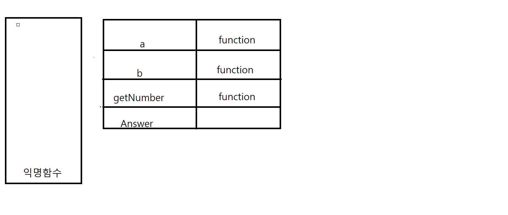

# 목차
- 콜백 함수 란?
- 콜백 함수를 사용한 문제풀이


## 콜백 함수 란?
매개변수에 함수 값을 전달했을 때 콜백 함수가 됩니다.

보통의 매개변수 처럼 일반적인 `값`이 전달 되는 것이 아닌 함수 값 자체를 전달해 버리기 때문에 전달 된 함수가 실행 되어야 합니다.


## 콜백 함수를 사용한 문제풀이

```js
function a (CB) {
    return CB
}
function b (CB){
    var fn = function() {
        return 30
    }
    var rst = 1 + CB(fn)
    return rst
}
function getNumber(CB){
    return 2*CB()
}

const Answer = b(getNumber)
console.log(Answer)
```
코드를 읽기 위해선 당연히 `평가`를 `실행`을 해야 합니다. `평가`를 먼저 진행 하겠습니다.



`평가`가 진행됐을 때 콜스택엔 익명함수가 생성되게 됩니다. 이후 선언문으로 선언된 변수들이 메모리에 자리를 마련합니다.

a , b , getNumber 는 함수이기 때문에 값에 function이 들어가고 const answer 은 `const`로 선언 되었기 때문에 값 부분이 비워져 있습니다.

`평가`가 다 진행 되었으면 이제 `실행`단계 입니다. 실행 할 수 있는 코드가 있는지 확인 하겠습니다.

현재 `실행`할 수 있는 코드는 const Answer = b(getNumber) 와 console.log(Answer) 인데 

위에서 부터 아래로 진행되기 때문에 먼저 const Answer = b(getNumber) 코드를 먼저 진행하게 됩니다.
그럼 function b (CB) 의 매개변수 CB는 getNumber()로 치환되게 됩니다. 

그러면 이제 function b의 `평가` 단계를 진행해 보겠습니다.


function b 안에 있는 var fn 과 var rst 는 `var`의 특성 때문에 처음의 값이 undefined 로 초기화 됩니다. 이후 `실행`단계로 넘어 갑니다.


`실행`을 하게 되며 var fn의 익명함수가 실행됩니다.

그럼 안에 있는 return 30 이 실행되며 익명함수를 종료 시키고 값 30을 넘기게 됩니다.

*(이후 콜스택에 있는 익명 함수는 자신의 소임을 다하고 사라지게 됩니다.)*


이게 rst 의 `실행`차례입니다. 1 + CB(fn)인데 우리가 거쳐온 단계에서 CB(fn)이 뭔지 잘 알 수 있습니다.

CB라는 매개변수는 분명 getNumber 함수 값으로 콜백 했습니다. 그러므로 CB = getNumber 
cb(fn) => getNumber(fn) => getNumber(fn) => 2 * CB() => CB = fn  => 2*fn() => 60 =>
1+ 60

그러면? 30의 값을 가지고 getNumber 함수로 가게 되고 