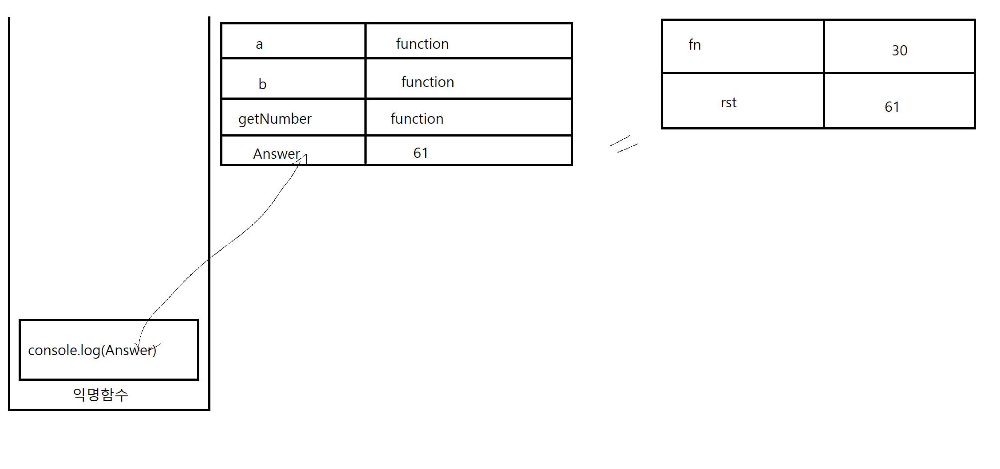

# 목차
- 콜백 함수 란?
- 콜백 함수를 사용한 문제풀이


## 콜백 함수 란?
매개변수에 함수 값을 전달했을 때 콜백 함수가 됩니다.

보통의 매개변수 처럼 일반적인 `값`이 전달 되는 것이 아닌 함수 값 자체를 전달해 버리기 때문에 전달 된 함수가 실행 되어야 합니다.


## 콜백 함수를 사용한 문제풀이

```js
function a (CB) {
    return CB
}
function b (CB){
    var fn = function() {
        return 30
    }
    var rst = 1 + CB(fn)
    return rst
}
function getNumber(CB){
    return 2*CB()
}

const Answer = b(getNumber)
console.log(Answer)
```
위 코드는 console.log(Answer) 에 무엇이 찍히는지 알아보는 문제입니다.

그럼 시작하겠습니다.

코드를 읽기 위해선 당연히 `평가`를 `실행`을 해야 합니다. `평가`를 먼저 진행 하겠습니다.


`평가`가 진행됐을 때 콜스택엔 익명함수가 생성되게 됩니다. 이후 선언문으로 선언된 변수들이 메모리에 자리를 마련합니다.

a , b , getNumber 는 함수이기 때문에 값에 function이 들어가고 const answer 은 `const`로 선언 되었기 때문에 값 부분이 비워져 있습니다.

`평가`가 다 진행 되었으니 이제 `실행` 단계 입니다. 실행 할 수 있는 코드가 있는지 확인 하겠습니다.

현재 `실행`할 수 있는 코드는 const Answer = b(getNumber) 와 console.log(Answer) 인데 

코드는 위에서 부터 아래로 진행되기 때문에 먼저 const Answer = b(getNumber) 를 먼저 진행 하겠습니다.

b(getNumber)의 형태는 function b (getNumber) 형태로써 매개변수 CB에 함수 getNumber 가 담기게 됩니다.

그러면 이 형태로 function b의 `평가` 단계를 진행해 보겠습니다.

function b 안에 있는 var fn 과 var rst 가 `평가`단계에서 찾아지게 되고 이 두 변수는 메모리에 자리를 찾게 됩니다. 

허나 `var`의 특성 때문에 처음의 값은 undefined 로 초기화 됩니다. 이후 `실행`단계로 넘어 갑니다.


`실행` 단계를 진행 하게 되며 var fn 안에 있는 익명함수가 실행됩니다. 이때 이 익명함수 또한 콜스택으로 들어가게 됩니다.

그럼 안에 있는 return 30 이 실행되며 익명함수를 종료 시키고 값 30을 넘기게 됩니다.

*(이후 var fn 안 익명 함수는 자신의 소임을 다하고 콜스택에서 사라지게 됩니다.)*


이제 rst 의 `실행` 단계 입니다. var rst 의 값은 1 + CB(fn)인데

CB라는 매개변수는 분명 처음 b ( )함수를 `실행`할 때 매개변수에 값에 getNumber를 넣어져 있었습니다. 

그러므로 CB(fn)은 getNumber(fn) 이 되며 return 2* CB()는 2*30이 되게 됩니다. 60이죠.

var rst = 1 + CB(fn) 인데 CB(fn) 가 60인걸 알았으니 var rst = 61이 되게 됩니다.

이제 var rst 의 `실행`이 끝났습니다. 이제 아래있는 return rst 가 실행되며 매개변수는 61이 되고 함수 실행을 종료합니다.

후 콜스택에 있던 b( )의 함수 호출도 끝이나고 콜스택에서 빠지게 됩니다.



이제 const Answer 아래에 있는 console.log(Answer) 가 실행 되면 코드가 끝이 납니다. 당연히 console.log ( ) 도 함수 이기 때문에 콜스택에 들어가게 되며 이후 실행이 진행되고 콘솔에 61이라는 숫자가 찍히며 콜스택에서 console.log가 사라진 후 마무리 되게 됩니다.

이 코드에서 결과적으로 `function a`는 한게 아무것도 없습니다. 단지 출제자(교수님)의 의도가 저 함수로 인해 햇갈리게 하기 위함이였으니 저 코드에 의문을 품었다면 출제자가 성공 하신거나 다름없습니다.